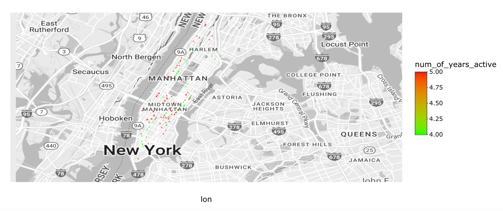

# Project 2: Shiny App Development

### [Project Description](doc/project2_desc.md)



In this second project of GR5243 Applied Data Science, we develop a *Exploratory Data Analysis and Visualization* shiny app on the work of a **NYC government agency/program** of your choice using NYC open data released on the [NYC Open Data By Agency](https://opendata.cityofnewyork.us/data/) website. In particular, many agencies have adjusted their work or rolled out new programs due to COVID, your app should provide ways for a user to explore quantiative measures of how covid has impacted daily life in NYC from different prospectives. See [Project 2 Description](doc/project2_desc.md) for more details.  

The **learning goals** for this project is:

- business intelligence for data science
- data cleaning
- data visualization
- systems development/design life cycle
- shiny app/shiny server

*The above general statement about project 2 can be removed once you are finished with your project. It is optional.

## Project Title: Shiny App Development
Term: Fall 2022

+ Team 11
+ **Projec title**: + Team members
	+ Ferra Suryani
	+ Fu Wang
	+ Jiaxi Fang
	+ Ruiyu Zhang
	

+ **Project summary**: In this project, we aim to discover how LinkNYC change in  different neighborhood in NYC along time, including pre-pandemic period and during pandemic. Specifically, we look at the usage trend or installation counts over the years in five boroughs of NYC. Also, we map out installation points to take a closer look at the usage density in Manhattan and Queens.

+ **Contribution statement**: 

Project: LinkNYC free Wi-Fi impacts on residents

Team members: Ferra Suryani, Fu Wang, Jiaxi Fang, Ruiyu Zhang

Summary: In this project, we dive deep into how LinkNYC free WiFi program brings an impactful contribution in making daily lives any better to the NY community (before and during COVID-19 pandemic). Investigations were done by digging into how the kiosk installation progresses over the years and monitoring usage trends within the last 5 years across the NY state.

[Contribution Statement] Ferra, Fu, Jiaxi, Ruiyu brainstormed and designed the study. Ferra carried out the skeleton of the RShiny webapp. Fu took part in dataset cleaning and conducted ETL process. Ferra, Fu, and Jiaxi came up with the visualizations. Ruiyu developed the About page to summarize the project overview. Ruiyu prepared the presentation and presented the project on behalf of the team. All team members contributed to the GitHub repository. All team members approve our work presented in our GitHub repository including this contribution statement.

Following [suggestions](http://nicercode.github.io/blog/2013-04-05-projects/) by [RICH FITZJOHN](http://nicercode.github.io/about/#Team) (@richfitz). This folder is orgarnized as follows.

```
proj/
├── app/
├── lib/
├── data/
├── doc/
└── output/
```

Please see each subfolder for a README file.

